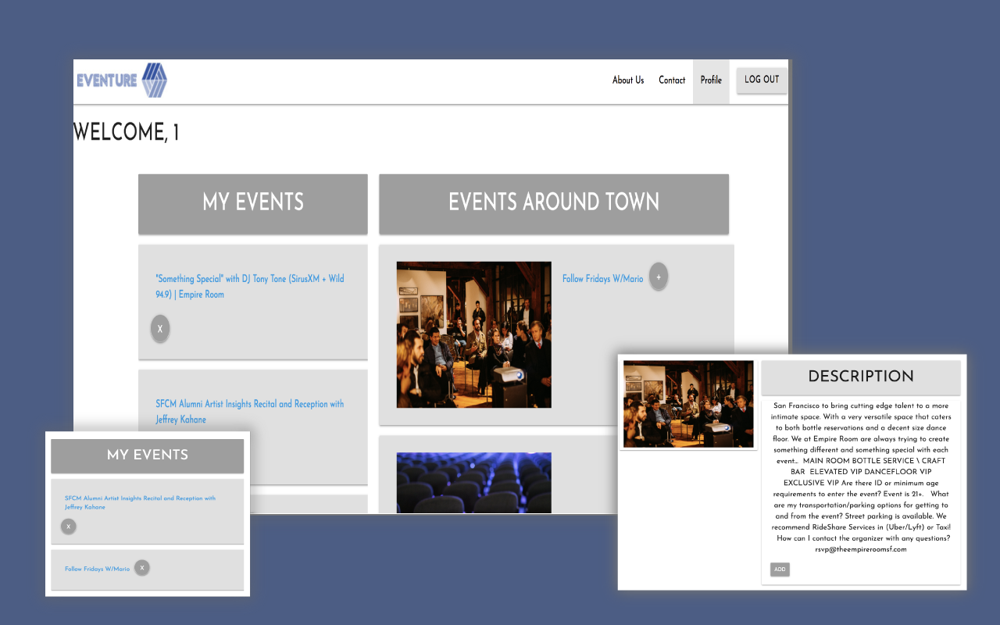

# Eventures



 Eventures is a site where users can see events happening in their current city


To view: clone this repo.

On the terminal run: rails server.

You will be able to create a new user.

Click on the profile tab to see events.

Click on the + "plus" circle next to any event to add events to your personal list.


## Technologies used:

Ruby on Rails, API integration, brycpt, git, github, heroku, JavaScript, jQuery, CSS, HTML

## Process/approach:

Discuss purpose of app
Whiteboard basic concept
Wire-framing


### My tasks included:
Create Client side including User and Events models

Assist in creating record associations

Assist in developing views

Assist in developing EventsController, UsersController

Crate API call to Eventbrite

## Code snippets

#### Create active record associations

```
class CreateUsers < ActiveRecord::Migration[5.1]
  def change
    create_table :users do |t|
      t.string :first_name
      t.string :last_name
      t.string :email
      t.string :password_digest

      t.timestamps
    end
  end
end

class CreateEvents < ActiveRecord::Migration[5.1]
  def change
    create_table :events do |t|
      t.string :event_name
      t.string :event_location
      t.string :event_date
      t.string :event_url
      t.text :event_description
      t.string :event_image

      t.timestamps
    end
  end
end

class CreateAttendances < ActiveRecord::Migration[5.1]
  def change
    create_table :attendances do |t|

      t.timestamps

      t.belongs_to :user
      t.belongs_to :event
    end
  end
end

models/user.rb

class User < ApplicationRecord

  has_many :attendances, dependent: :destroy
  has_many :events, through: :attendances
...

models/event.rb

class Event < ApplicationRecord
  has_many :attendances, dependent: :destroy
  has_many :users, through: :attendances
...

models/attendance.rb

class Attendance < ApplicationRecord
  belongs_to :user
  belongs_to :event

```

#### Each user has own events list in the profile section. Events can be added to the list or deleted from the list.

```
app/controllers/attendance_controller.rb

class AttendanceController < ApplicationController
  def index
    @user = User.find(params[:user_id])
    @events = @user.events
  end

  def create
    @event = Event.find(params[:event_id])
    if current_user.events.exists?(event_name: @event.event_name)
      flash[:notice] = "Event already in your calendar"
      redirect_to current_user
    else
    current_user.events << @event

    redirect_to current_user
    end
  end

  def destroy
    @event = current_user.events.find(params[:id])
    # @event.destroy
    current_user.events.delete(@event)
    flash[:notice] = "Successfully removed event."
    redirect_to user_path(current_user)
  end
end
```

### AJAX call to Eventbrite API

```
function delayedCall() {
  $.ajax({
    method: "GET",
    url: sf,

    success: function(json) {
      displayEvents(json);
    },
    error: function() {
      alert("There was an error getting event data.");
    },
    beforeSend: function() {
      $("#page").append("Loading");
    },
    compvare: function() {
      $("#loading").remove();
    }
  });
}

setInterval(delayedCall, 86400000); // 86400000 milliseconds in a day

var allEeventsList = [];
var displayEvents = function(json) {
  tab = json.events;

  json.events.forEach(function(event, i) {

    var eventInstance =
      "<div class='event-section'><div class='event_item'><div class='row event-row'><p class='title sidebyside'> " +
      event.name.text +
      "</p></div></div></div>";
    $("#info").append(eventInstance);
  });
};
```

## Future development:

- map of each event
- individual event page
- filters for type of events
- Oauth Goog tec.

## Team Profiles

[Manjila Nakarmi](https://github.com/Manjilan)

[Felix Chow ](https://github.com/fchow2018)

[Terrence Langston](https://github.com/ttime1100)

[Juan Carlos Collins](https://github.com/juancarlucci)
